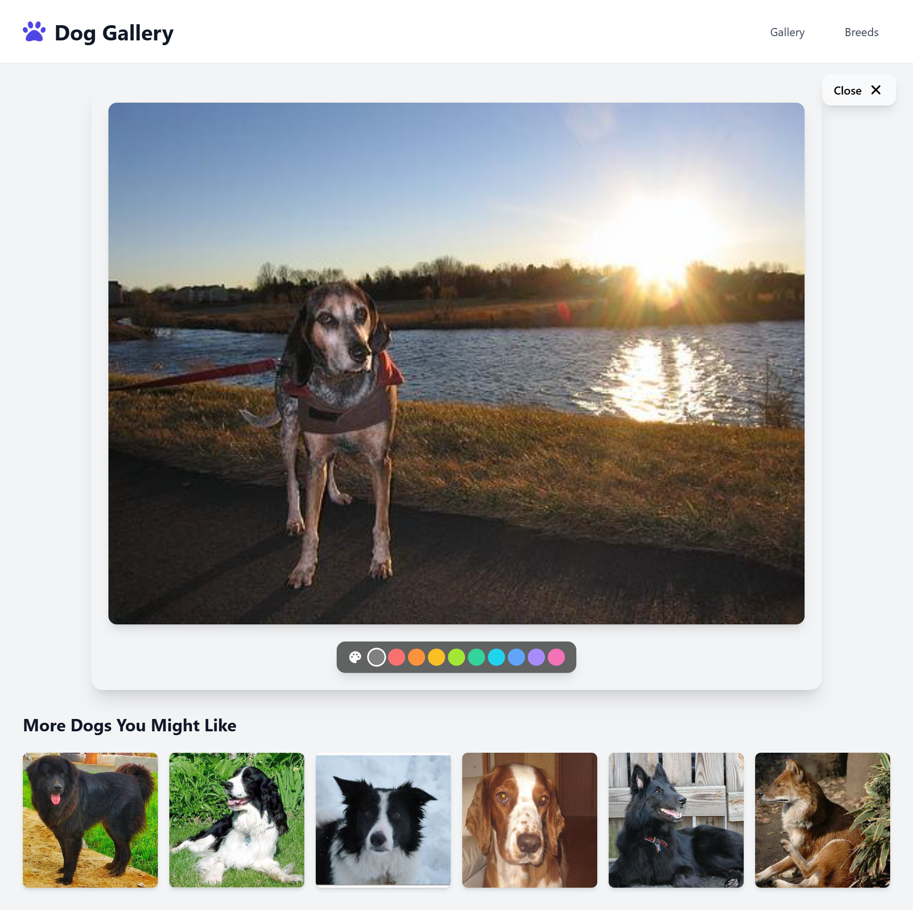

# Dog Image Gallery [Visit Website](https://dog-image-gallery-seven.vercel.app/)

Dog Image Gallery is a feature-rich, visually appealing application built using React and the [Dogs API](https://dog.ceo/dog-api/). It provides users with an engaging way to explore, view, and interact with a wide variety of dog images. This project highlights the power of React's hooks, state management, and dynamic routing while focusing on delivering a seamless and enjoyable user experience.


## Features

This application includes the following key features:

1. **Image Grid:**
   - A responsive grid layout that displays a collection of dog images fetched from the Dogs API.
   - Ensures a smooth browsing experience with lazy loading for images, optimizing performance and loading times.

2. **Image Detail View:**
   - Allows users to click on any image in the grid to view it in a larger size.
   - Displays the image in a detail-focused layout with additional customization options, such as background color adjustment.

3. **Background Color Picker:**
   - A fully interactive color picker is included, enabling users to customize the background of the image detail view.
   - Users can experiment with colors to create their preferred visual style.

4. **Loading States:**
   - Shows loaders during data fetching or other loading actions, ensuring users are informed about the application's state.
   - Provides a smoother experience, especially when waiting for content to load.

5. **Explore Dog Categories:**
   - The grid refreshes with a new set of random dog images when users navigate or interact with specific features, making every visit unique.



## Screenshots

### Explore Dogs Category
Discover and explore a variety of dogs in an interactive, beautifully designed interface.


---

## Installation

To run the project locally and explore the Dog Image Gallery, follow the steps below:

1. **Clone the Repository:**
   - Use the following command to clone the project to your local machine:
     ```bash
     git clone https://github.com/shashank2314/Dog-Image-Gallery-Website
     ```
   - Navigate to the project directory:
     ```bash
     cd Dog-Image-Gallery-Website
     ```

2. **Install Dependencies:**
   - Install the necessary dependencies using npm:
     ```bash
     npm install
     ```
   - This will set up the required libraries and modules for the project to run.

3. **Start the Development Server:**
   - Start the application in development mode:
     ```bash
     npm start
     ```
   - Open your browser and navigate to [http://localhost:3000](http://localhost:3000) to view the application.

4. **Build for Production:**
   - If you'd like to build the project for production, use:
     ```bash
     npm run build
     ```
   - The optimized build files will be generated in the `build` directory.

5. **Deploy the Application:**
   - The application can be deployed on platforms like Vercel, Netlify, or GitHub Pages. For example:
     - Deploy on Vercel:
       ```bash
       npx vercel deploy
       ```

---

## Technical Details

### Tools and Libraries Used

- **React:** A powerful JavaScript library for building user interfaces with components and hooks.
- **React Router:** Used for managing navigation and dynamic routing within the application.
- **Tailwind CSS:** A utility-first CSS framework for designing responsive and clean user interfaces.
- **Dogs API:** A free API providing dog images with no authentication required.
- **React Icons:** Provides scalable icons for UI enhancements.

### API Integration

The application integrates with the [Dogs API](https://dog.ceo/dog-api/) to fetch random dog images. The API's simplicity and ease of use make it ideal for learning and experimentation.

- Example Endpoint:
```bash
GET https://dog.ceo/api/breeds/image/random/6
```

This endpoint fetches six random dog images, which are displayed in the image grid.

---

## Approach and Workflow

1. **Fetching and Displaying Data:**
 - The application uses React's `useEffect` hook to fetch data from the Dogs API upon component mount.
 - The `useState` hook is used to manage and display the fetched data dynamically.

2. **Dynamic Routing with React Router:**
 - Users can navigate between the grid and the detailed view of individual images.
 - The URL dynamically updates based on the selected image, ensuring a seamless navigation experience.

3. **Interactive UI with Customization:**
 - A background color picker in the detailed view enhances interactivity by allowing users to personalize the display.

4. **Responsive Design:**
 - Tailwind CSS ensures the application is fully responsive across devices, delivering a consistent user experience.

---

## Challenges and Solutions

1. **Dynamic State Management:**
 - **Challenge:** Keeping the application state in sync with dynamic routing.
 - **Solution:** Used React Router's `useNavigate` hooks to manage state based on URL changes.

2. **Image Loading Performance:**
 - **Challenge:** Ensuring images load efficiently without slowing down the UI.
 - **Solution:** Implemented lazy loading for images to optimize performance.

3. **Styling and Responsiveness:**
 - **Challenge:** Designing a UI that works across different screen sizes.
 - **Solution:** Utilized Tailwind CSS for creating a responsive, mobile-friendly layout.

---

## Future Enhancements

1. **Add Filter Options:**
 - Allow users to filter images by breed or category.

2. **Enhanced Background Customization:**
 - Add a gradient picker or advanced color options for more customization.

---

Happy exploring, and may your love for dogs grow stronger with every click! 🐾

